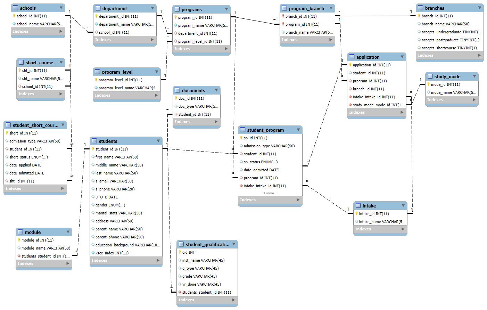

# 📚 School Admission Database System

## 🧾 Project Overview

This project focuses on the design and implementation of a **relational database system** to manage school admissions efficiently. It captures key academic structures such as programs, branches, intakes, study modes, sponsorship types and students ensuring data consistency and scalability.

The database is designed following proper **database normalization principles** and represented using an **Entity Relationship Diagram (ERD)**.

---

## 🎯 Objectives

* Design a well-structured relational database for a school admission system
* Apply normalization to reduce redundancy
* Implement primary keys and foreign key relationships
* Practice SQL for table creation and data integrity

---

## 🗂️ Scope of the System

The database supports:

* Multiple school departments
* Undergraduate, postgraduate and short courses
* Different intakes (e.g. May, September)
* Study modes (Full-time, Part-time)
* Sponsorship types (Self-sponsored, Government-sponsored)

---

## 🧩 Database Entities

The main entities include:

* **Students**
* **Programs**
* **Branches**
* **Courses**
* **Intakes**
* **Study Modes**
* **Sponsorship Types(modules)**

Each entity is uniquely identified using a **primary key** with relationships enforced through **foreign keys**.

---

## 🧠 Entity Relationship Diagram (ERD)

The ERD illustrates:

* One-to-many relationships between branches and programs
* Student enrollment linked to programs and intakes
* Reference tables for study modes and sponsorship types

## 🧠 Entity Relationship Diagram (ERD)


<p align="center">
  
</p>


---

## 🛠️ Technologies Used

* **MySQL** 🐬 – Database Management System
* **SQL** – Table creation and constraints
* **Git & GitHub** – Version control and collaboration

---

## 🚀 How to Set Up the Database

1. Clone the repository
2. Open MySQL Workbench or preferred SQL tool
3. Import the provided `.sql` file
4. Execute the script to create tables

```sql
SOURCE school_admission_db.sql;
```

---

## 🔐 Database Design Considerations

* Data integrity enforced using foreign keys
* Reference tables used for fixed attributes (study mode, intake, sponsorship)
* Designed to support future expansion

---

## 📌 Assumptions

* A student can enroll in one program per intake
* Programs belong to a specific branch
* Study modes and sponsorship types are predefined

---

## 👥 Contributors

* Ian Gitonga
* Morine Wanjiru
* Lionel Mwangi
* Benedict Karani
* Yvonne Tashy
* Angela Baraka
* Kennedy Mokaya
* Geremi Mwangi
* Esther Njeri
* Enes Parsintei
* Mike Njunguna 

